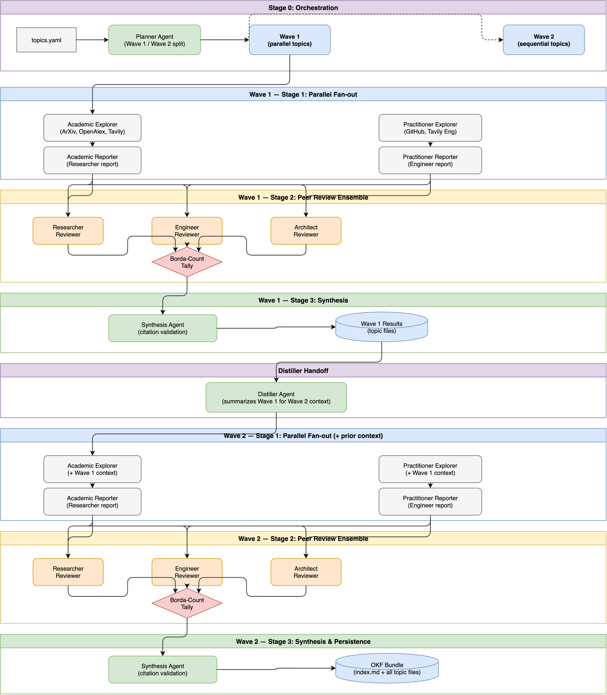

# Multi-Agent Literature Review Pipeline

A multi-agent literature review pipeline built with the [Google ADK](https://github.com/google/google-adk) (Agent Development Kit). It coordinates specialized agents to iteratively research sub-topics based on a YAML configuration. For each topic, it searches from academic and practitioner perspectives, evaluates the work through a peer review ensemble, and synthesizes a well-grounded report.

Built as a capstone submission for the Kaggle "[AI Agents: Intensive Vibe Coding Capstone](https://www.kaggle.com/competitions/vibecoding-agents-capstone-project/)".

mcp-name: io.github.Ravicha2/lit-review-council

## Motivation

Literature reviews are suffocating: hundreds of papers, conflicting claims, and no obvious signal in the noise. Andrej Karpathy's [LLM Council](https://github.com/karpathy/llm-council) showed that multi-agent debate surfaces sharper answers than a single prompt. This project takes that insight into the research domain.

LLMs researching complex topics suffer from two problems: lack of diverse grounding and self-preference bias (favoring their own outputs).

This pipeline addresses both:

1. **Tiered Orchestration**: A Planner agent splits configured research topics into a multi-wave execution graph. Foundational concepts (Wave 1) run in parallel, and synthesis-dependent topics (Wave 2) run sequentially with distilled context from Wave 1.
2. **Source Isolation**: Two independent tracks per topic, each with its own explorer (search) and reporter (write) agent. The academic track searches ArXiv, OpenAlex, and scholarly publishers. The practitioner track searches GitHub and engineering docs.
3. **Peer Review Ensemble**: Three reviewers (Researcher, Engineer, Neutral) evaluate anonymized reports. Borda-count voting aggregates rankings so no single reviewer dominates.
4. **Anti-Hallucination Guardrails**: The Synthesis agent's output is parsed and validated. Dangling citations like `(Author, Year)` or `[1]` are rejected. Every URL in the final report must exist in the original source references, or the run is retried (up to 2 times). A blog-tier ratio check warns when over 50% of sources are blog/forum tier.

## Setup & Installation

Published to [PyPI](https://pypi.org/project/lit-review-council/) and the [MCP Registry](https://github.com/mcp). No clone or manual config needed.

### 1. MCP Registry (Recommended, one command)

The server is listed on the MCP Registry, so installing is a single command. No JSON editing, no config files.

**Claude Code:**

```bash
claude mcp add lit-review-council \
  -e OPENROUTER_API_KEY=sk-or-your-key \
  -e GITHUB_TOKEN=ghp_your-token \
  -e TAVILY_API_KEY=tvly_your-key \
  -- uvx lit-review-council
```

**VS Code:** Search for "lit-review-council" in the MCP Registry and click **Install**. Or open the [MCP Registry listing](https://github.com/mcp) and click **Install in VS Code**.

**Any other MCP client:** See section 2 below.

Once connected, the `lit_review_council_instructions` prompt is available to guide any AI agent through the full review workflow.

### 2. Manual Config (Claude Desktop, Cursor, etc.)

Add this to your client's MCP server config:

```json
{
  "mcpServers": {
    "lit-review-council": {
      "command": "uvx",
      "args": ["lit-review-council"],
      "env": {
        "OPENROUTER_API_KEY": "sk-or-your-key",
        "GITHUB_TOKEN": "ghp_your-token",
        "TAVILY_API_KEY": "tvly_your-key",
        "OPENALEX_API_KEY": "your-key"
      }
    }
  }
}
```

| Client | Config path |
|--------|-------------|
| Claude Desktop (Mac) | `~/Library/Application Support/Claude/claude_desktop_config.json` |
| Claude Desktop (Win) | `%APPDATA%\Claude\claude_desktop_config.json` |
| Cursor | `.cursor/mcp.json` |

### 3. Local Developer Setup

```bash
git clone https://github.com/Ravicha2/lit-review-council && cd lit-review-council
cp .env.example .env   # fill in your keys
uv run python main.py --config topics.yaml --output okf_output --question "Your Research Question"
```

### Environment Variables

| Variable | Purpose | Required |
|----------|---------|----------|
| `OPENROUTER_API_KEY` | LLM access via OpenRouter | Yes |
| `GITHUB_TOKEN` | Practitioner track (GitHub search) | Yes |
| `TAVILY_API_KEY` | Web search across both tracks | Yes |
| `OPENALEX_API_KEY` | Academic track (OpenAlex API) | Yes |
| `ENG_MODEL` | Model for engineer agents | No (default: `openrouter/moonshotai/kimi-k2.6`) |
| `RESEARCH_MODEL` | Model for research agents | No (default: `openrouter/z-ai/glm-5.1`) |
| `JUDGE_MODEL` | Model for reviewers & synthesis | No (default: `openrouter/deepseek/deepseek-v4-pro`) |

## Architecture



The pipeline is organized into **four stages**, with topics executed across **two waves** to balance parallelism and sequential dependency.

### Why Two Waves?

Not all research topics are independent. Some topics (e.g., foundational concepts like "truth maintenance systems") can be researched in parallel, while others (e.g., "multi-agent coordination using TMS") depend on the synthesized understanding of earlier topics.

The **Planner agent** reads `topics.yaml` and partitions topics into:

- **Wave 1** — parallel, independent topics. All topics in this wave run simultaneously through the full Stage 1→2→3 pipeline.
- **Wave 2** — sequential, dependent topics. These topics require the distilled context from Wave 1 before they can be researched accurately.

### Wave Handoff via the Distiller

After Wave 1 completes, the **Distiller agent** consumes the Wave 1 topic files and produces a compact summary of the foundational findings. This distilled context is injected into every Wave 2 topic's prompt as additional background, ensuring Wave 2 explorers and reporters build on top of verified Wave 1 conclusions rather than starting from scratch.

This prevents redundant searches and improves coherence across the final OKF bundle.

### Stage Breakdown

```ini
Stage 0 (Orchestration)
├── Planner agent organizes YAML topics into Wave 1 (parallel) and Wave 2 (sequential)
└── Distiller agent summarizes completed Wave 1 topics to provide prior context to Wave 2

Stage 1 (Parallel Fan-out per Topic)
├── Academic Track (SequentialAgent)
│   ├── academic_explorer  → searches ArXiv, OpenAlex, Tavily (scholarly domains)
│   └── academic_reporter  → writes Researcher report with structured references
└── Practitioner Track (SequentialAgent)
    ├── practitioner_explorer → searches GitHub, Tavily (engineering domains)
    └── practitioner_reporter → writes Engineer report with structured references

Stage 2 (Peer Review Ensemble per Topic)
├── researcher_reviewer  → ranks anonymized reports (Researcher perspective)
├── engineer_reviewer    → ranks anonymized reports (Engineer perspective)
└── technical_reviewer   → ranks anonymized reports (Neutral perspective)
    → Borda-count tally → winning report selected

Stage 3 (Synthesis & Persistence)
├── synthesis agent → condensed final brief with YAML frontmatter
│   → citation validation loop (rejects hallucinated/dangling URLs, retries up to 2x)
└── Writes out to an interconnected Markdown OKF bundle (index.md and topic files)
```

## Search Providers

| Provider | Domains | Used By |
|----------|---------|---------|
| ArXiv API | arxiv.org | Academic explorer |
| OpenAlex API | openalex.org | Academic explorer |
| Tavily (scholarly) | acm.org, ieee.org, springer.com, sciencedirect.com, nature.com, science.org, wiley.com | Academic explorer |
| GitHub API | github.com | Practitioner explorer |
| Tavily (engineering) | github.com, docs.microsoft.com, aws.amazon.com, cloud.google.com, medium.com, dev.to | Practitioner explorer |

All providers use tenacity retry with exponential backoff for 429/5xx errors.

## Source Tiers

Every reference is classified into one of four tiers:

- __peer_reviewed__: ArXiv preprints, ACM/IEEE papers, conference proceedings
- __established_project__: GitHub repos with meaningful adoption (stars, active maintenance)
- __vendor_doc__: Official documentation from a company/project
- __blog_or_forum__: Medium, personal blogs, Stack Overflow, Reddit

The synthesis step warns when more than half of cited sources are blog_or_forum tier.

### Output

The pipeline runs all stages for each topic, executing them in waves where possible. On completion, it generates an interconnected Markdown bundle (OKF format) in the specified output directory, including an `index.md` linking to each specific topic file.